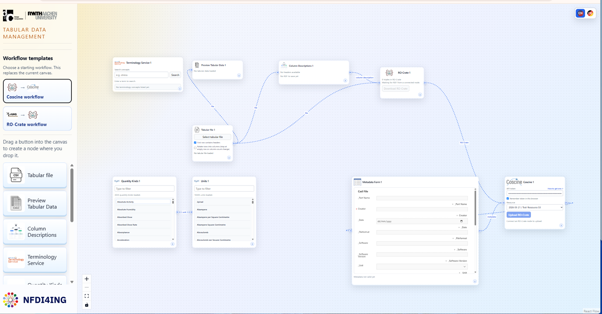
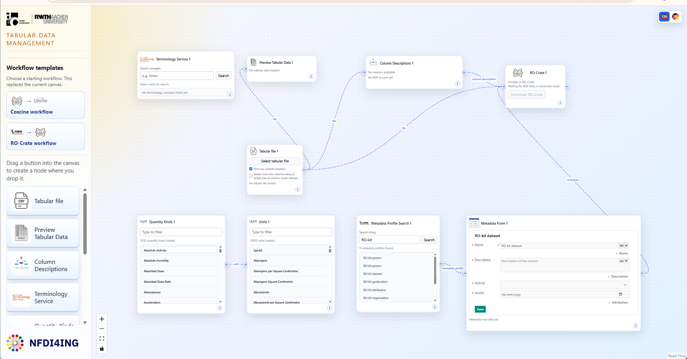

# Tabular

Tabular helps researchers turn familiar CSV and Excel files into documented,
shareable research outputs. Its visual workflow brings column annotation,
dataset metadata, RO-Crate packaging, and optional Coscine deposit into one
place.



## Start Tabular

### Windows

Download `TabularRDM-1.0.0-x64-Portable.exe` from the official
[Tabular releases page](https://github.com/jyrkioraskari/TabularRDM/releases)
and open it. The portable application normally needs neither installation nor
administrator rights.

### Run from source

Install Node.js 18 or newer, then run:

```sh
npm install
npm run dev
```

Open <http://localhost:5173/>.

## Tutorial: create your first RO-Crate

The starting canvas already contains a complete basic workflow. Connections
enter a node on the left and leave it on the right. Hover over an input handle
to see which node types it accepts.

### 1. Load and check the table

In **Tabular file**, choose **Select tabular file** and open a CSV or Excel
file. **Preview Tabular Data** shows its headers and first rows.

Keep **First row contains headers** selected when row one contains column
names. Clear it for headerless data.

### 2. Explain the columns

In **Column Descriptions**, write a precise meaning for each field. For
example, describe `air_temperature` as “Ambient air temperature at the
sensor,” rather than repeating the header.

For reusable semantic annotations, drag a concept from **Terminology Service**
into a description field.

### 3. Add quantities and units

Search **Quantity Kinds** for a measurement type, select it, and inspect the
matching entries in **Units**. Drag the correct unit into the relevant column.
Leave identifiers and genuinely unitless values empty.

### 4. Describe the dataset

Complete **Metadata Form**, including every required field, and choose
**Save**. This metadata describes the dataset as a whole; column descriptions
explain its individual fields.

### 5. Download the package

The **RO-Crate** node combines the data and descriptions. When it reports
loaded RDF triples, choose **Download RO-Crate**.

```text
Tabular file ──┬──> Preview Tabular Data
               ├──> Column Descriptions ──┐
               └───────────────────────────┼──> RO-Crate ZIP
Metadata Form ─────────────────────────────┘
```

The ZIP contains the tabular data, RDF metadata, and a standard RO-Crate
catalogue. Keep it intact when sharing or archiving it.

## Optional: deposit in Coscine

Add a **Coscine** node and connect **RO-Crate → Coscine**. Tabular
automatically connects the matching Metadata Form—or creates one when needed—
so the selected Coscine resource can provide its metadata requirements.

Enter an API token, load and select a writable resource, complete and save the
resulting form, then choose **Upload RO-Crate**. Nothing is uploaded before
that final action.



## Learn more

Use the [documentation guide](docs/README.md) to continue with short,
task-focused pages:

- [Why Tabular connects these services](docs/why-tabular.md)
- [Describe columns with terminology, quantities, and units](docs/semantic-columns.md)
- [Prepare data and understand the RO-Crate](docs/data-and-ro-crate.md)
- [Deposit an RO-Crate in Coscine](docs/coscine.md)
- [Use the canvas, connections, and saved layouts](docs/interface.md)
- [Troubleshoot safely](docs/troubleshooting.md)
- [Develop and build Tabular](docs/development.md)

Each workflow node also has an `i` button with instructions for that step.

<p align="right">
  
</p>
